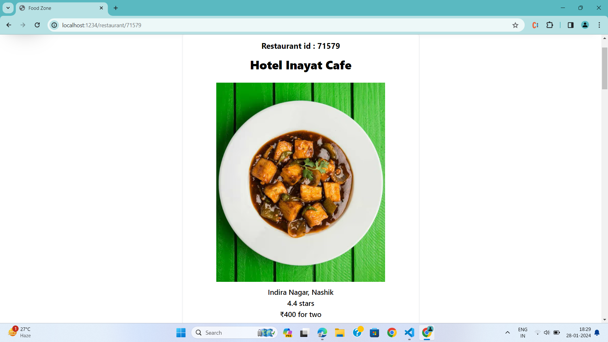

# FoodZone React App

## Overview

FoodZone is a React app that simulates a food delivery platform. This project is built using ReactJS, Redux, TailwindCSS, and Parcel as the bundler. 
It provides users with the ability to browse restaurants, view menu items, and add items to the cart.

## Features

- **ReactJS:** The project is developed using React for building a dynamic and interactive user interface.

- **Redux:** State management is handled using Redux, providing a centralized store for managing application state.

- **TailwindCSS:** The UI is styled with TailwindCSS, offering a sleek and responsive design.

- **Parcel:** Parcel is utilized as the bundler for a straightforward and efficient build process.

- **React Router DOM:** Navigation within the app is facilitated by React Router DOM for a seamless user experience.


## Screenshots and Demo

### Main Page


### Searched Restaurant


### Restaurant


### Restaurant Menu


### Cart Items


### Food Ordering Website 1 (GIF)


### Food Ordering Website 2 (GIF)


## Getting Started

### Installation

1. Clone the repository:

    ```bash
    git clone https://github.com/your-username/FoodZone-React-App.git
    ```

2. Change into the project directory:

    ```bash
    cd FoodZone-React-App
    ```

3. Install dependencies:

    ```bash
    npm i -D parcel
    npm i react
    npm i react-dom
    npm i react-router-dom
    npm i -D tailwindcss postcss
    ```

### Usage

Run the development server:

```bash
npx parcel index.html


